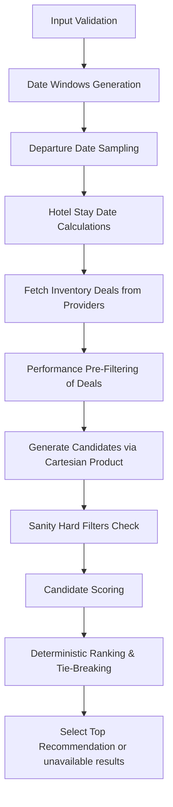

# Developer Integration Guide

This guide describes how to integrate and extend the `bucket_list_recommendation_engine` package in your backend.

---

## 1. Recommendation Flow & Lifecycle

The engine coordinates recommendation generation through the following step-by-step lifecycle:

1. **Input Validation**: Enforces integrity constraints on the itinerary and dates, raising structured exceptions on failures.
2. **Date Generation & Sampling**: Determines boundaries for "This Month", "Months 1–3", and "Months 4–6" windows relative to a reference date. Samples up to 5 dates per window.
3. **Provider Queries**: Queries flight and hotel deals for every sampled departure date.
4. **Pre-Filtering (Optimization)**: Validates each deal leg individually to filter out mismatched routes, incorrect check-in/out dates, and missing rating/pricing info before generation.
5. **Candidate Generation**: Builds candidate packages from pre-filtered pools using Cartesian product combinations.
6. **Hard Filtering**: Validates itinerary contiguity, total duration, and exact hotel tiers.
7. **Scoring**: Scores valid candidates using a weighted sum of normalized indicators (Hotel Quality, Flight Convenience, Value, Cancellation Policy, Seasonality).
8. **Ranking & deterministic selection**: Selects the best recommendation for each tier using deterministic tie-breakers.

---

## 2. Business Models

- **`Destination`**: Represents a stop. Stay duration in nights matches requested `days` (`days == hotel_nights`).
- **`Itinerary`**: Immutable sequence of `Destination` objects. Order and names must be preserved.
- **`FlightDeal` & `HotelDeal`**: Normalized business offers received from providers.
- **`BucketListRecommendationInput`**: Structure containing origin, reference date, itinerary, and optional seasonality profiles.
- **`RecommendationRecommendation`**: A generated recommendation option.
- **`UnavailableResult`**: Represents a tier/window where no valid candidates exist, including structured error reason codes.
- **`BucketListRecommendationResult`**: The final return type containing lists of `WindowRecommendations`.

---

## 3. Scoring & Ranking Config

The candidate scores are calculated based on these weights (configured via `ScoringWeightsConfig`):

- **Hotel Quality (35%)**: Average hotel ratings (50%), reviews count volume log-scaled (25%), and rating variance consistency across all stops (25%).
- **Flight Convenience (25%)**: Stops count penalty (50%) and roundtrip duration limits (50%).
- **Package Value (25%)**: Min-max scaling of total package cost relative to other candidates generated within the *same* departure window and tier.
- **Cancellation Flexibility (10%)**: Average refundability coefficient across both flight legs and hotel stays.
- **Seasonality (5%)**: Average monthly seasonality score lookup. Falls back to neutral 0.5 if seasonality data is missing.

### Deterministic Tie-Breaker Order
If two candidates achieve identical composite scores, the tie is broken deterministically by:
1. **Lower package price** (`pricing.total_cost`)
2. **Fewer combined stops**
3. **Shorter combined flight duration**
4. **Better cancellation policy score**
5. **Stable lexicographical Recommendation ID** comparison

---

## 4. Provider Abstraction Layer

The recommendation engine depends entirely on the abstract interfaces defined in `bucket_list_recommendation_engine/providers/interfaces.py`:
- `FlightInventoryProvider`
- `HotelInventoryProvider`

All provider-specific formats must be mapped to normalized domain models using the adapters in `bucket_list_recommendation_engine/providers/normalizers.py` before candidate compilation.

### Guidelines for Implementing New Providers
To plug a new flight or hotel inventory supplier (e.g. Amadeus, Sabre, HotelBeds, or local database):
1. Write a subclass of `FlightInventoryProvider` or `HotelInventoryProvider`.
2. Implement the abstract query methods (`get_flight_deals` or `get_hotel_deals`).
3. Inside your query implementation, fetch the raw API responses.
4. Pass the dictionary payloads to `normalize_flight_deal` or `normalize_hotel_deal` in `normalizers.py` to get clean domain deals.
5. Return the list of normalized deals to the orchestrator.

---

## 5. Custom Exceptions

- **`InvalidItineraryError`**: Raised on empty itineraries, negative stay days, or empty stop names.
- **`InvalidTravelDatesError`**: Raised on date range anomalies.
- **`MissingInventoryError`**: Raised when providers return zero flight or hotel deals across the entire request lifecycle.
- **`UnsupportedTierError`**: Raised on invalid hotel tier inputs.
- **`InvalidPricingError`**: Raised on negative deal pricing or broken breakdown calculations.
